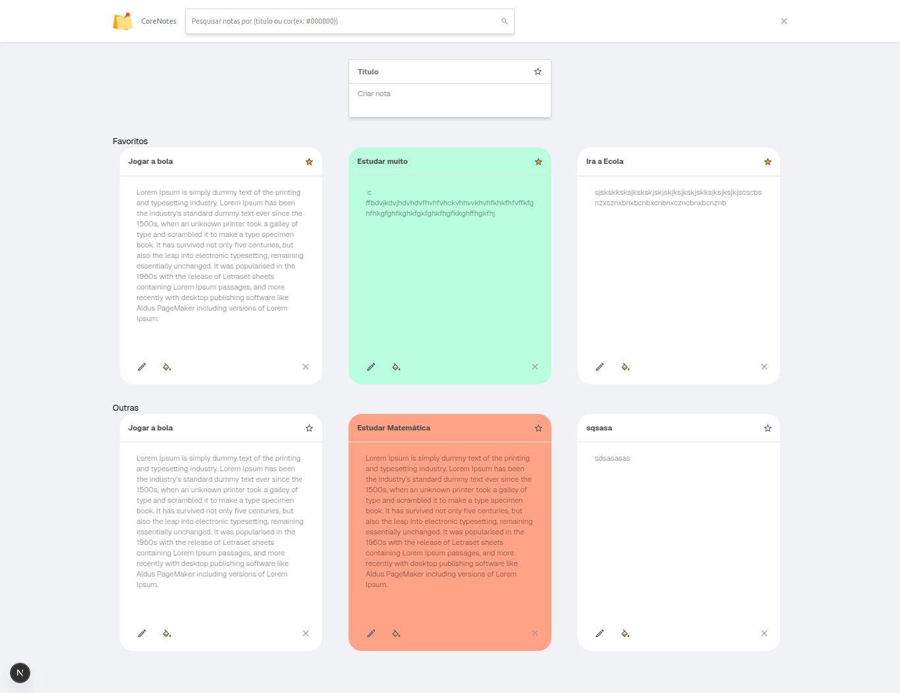

# 📌 Lista de tarefas

Gerencie suas tarefas de forma simples e eficiente com este sistema. Este projeto é composto por um frontend desenvolvido em React (NextJS) e um backend baseado em Node.js (AdonisJS).

---

## 🚀 **Funcionalidades**

### **Frontend**

- Interface limpa e responsiva
- Criação, leitura, atualização e exclusão de tarefas.
- Favoritos.
- Personalização de cores das tarefas.
- Filtragem por Titulo e core das tarefas.


## 🛠️ **Tecnologias Utilizadas**

### **Frontend**

- **NextJs**
- **Tailwind CSS** para estilização.
- **Shadcn** para componentes.
- **React Hook Form & Zod** para formulários.
- **Axios** para consumo da API.
- **Zustand** para gerenciamento de Estados.
- **Typescript** para Tipagem.


## ⚙️ **Pré-requisitos**

Certifique-se de ter instalado:

- **Node.js** >=22.x
- **PNPM** ou **NPM**.

## 🛠️ **Como Configurar o Projeto**

1. Clone o repositório:

```bash
   git clone https://github.com/EvandroEusebio/corelab-web-challenge.git
   
```

2. Acesse a pasta do projecto FrontEnd:

```bash
   cd corelab-web-challenge
```

3. Instale as dependencias

```bash
   pnpm i
   ou
   npm install
```

4. Acesse o arquivo src/service/api.ts e configure:

```bash
   const axiosInstance = axios.create({
  baseURL: "http://localhost:5000", // Insira sua url do local
  headers: {
    "Content-Type": "application/json",
  },
});
```

5. Inicie o projeto:

```bash
   pnpm run dev
```

🧪 Como Usar

- **Acesse o Frontend: Ex. http://localhost:5173.**
- **Gerencie suas Tarefas no painel.**

📖 Rotas da API

- **GET /api/todo/** Obter as Tarefas.
- **POST /api/todo/create** Criar um Tarefa.
- **PUT /api/todo/edit/{id}** Editar uma tarefa.
- **DELETE /api/todo/delete/{id}** Deletar uma tarefa.


📧 Contato

- **Email: ** eusebioevandro01@gmail.com
- **GitHub: ** https://github.com/EvandroEusebio
- **Linkedin: ** https://www.linkedin.com/in/evandro-eus%C3%A9bio-121a5a26a/
